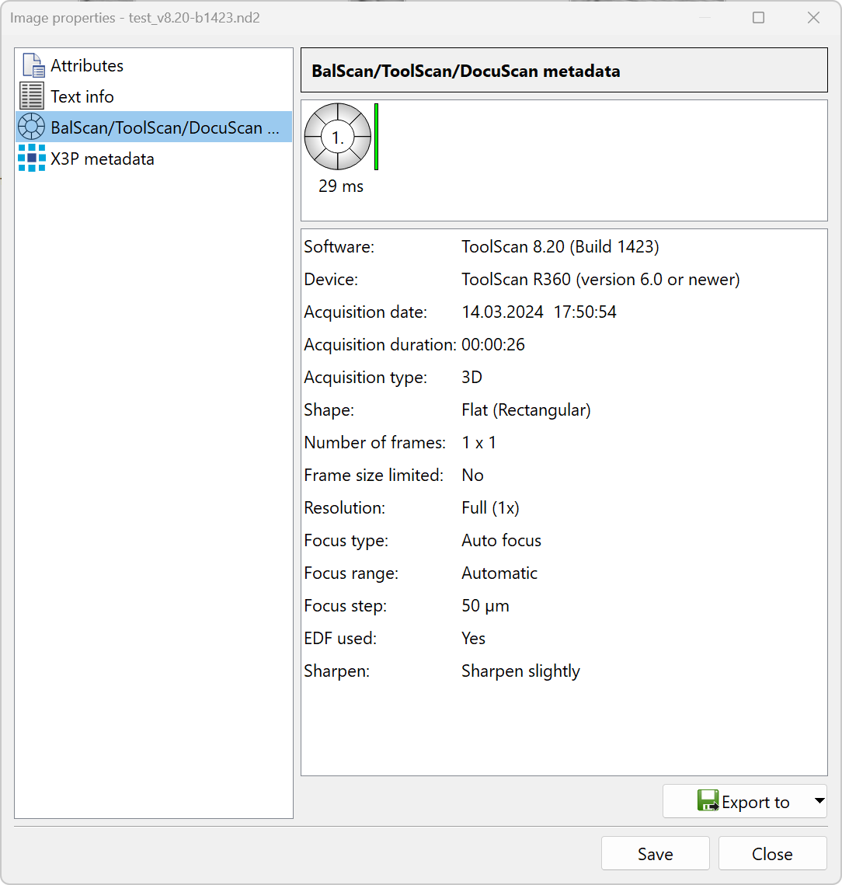
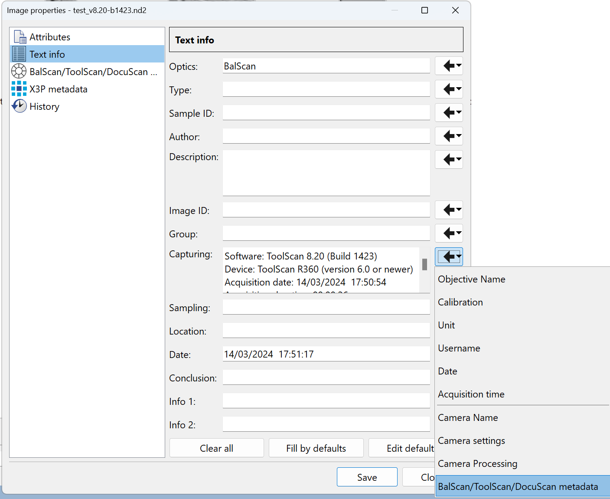
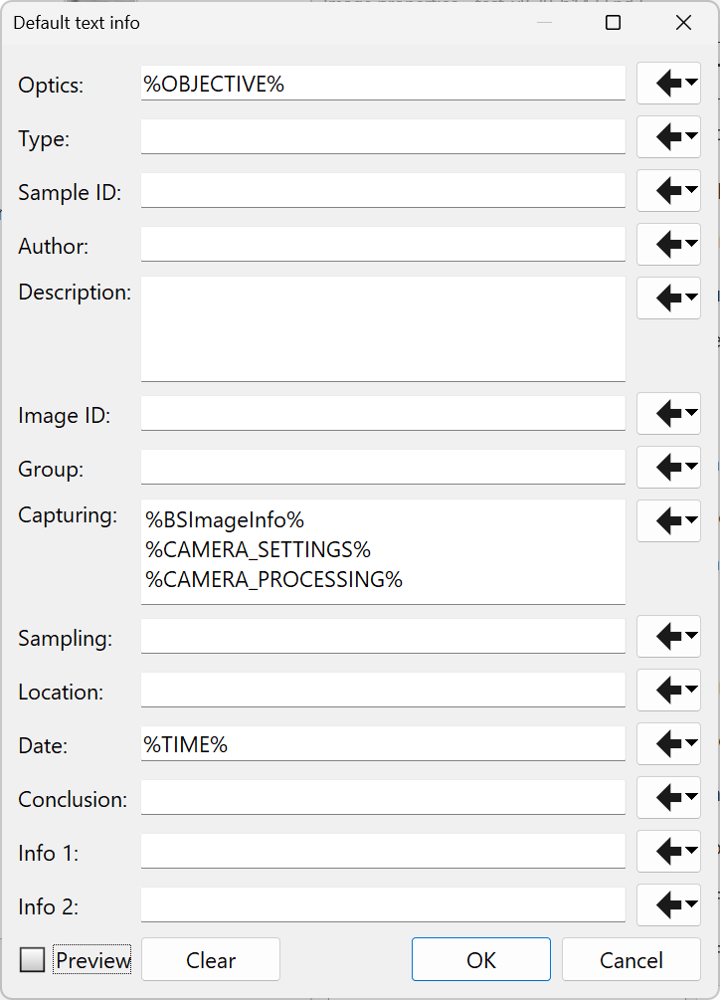

<!-- TOC ignore:true -->
# Template LIM ToolScan

By Ivan Calandra

<!-- TOC ignore:true -->
# Table of content

<!-- TOC -->

- [Introduction](#introduction)
- [What and how to report](#what-and-how-to-report)
    - [Method section of a paper](#method-section-of-a-paper)
    - [Data & Metadata](#data--metadata)
        - [General](#general)
        - [Data to share](#data-to-share)
        - [How to share metadata](#how-to-share-metadata)
            - [Export metadata](#export-metadata)
            - [Access via the free viewer](#access-via-the-free-viewer)
        - [README](#readme)

<!-- /TOC -->

# Introduction

This template explain what I think is important to report and how to report this information for images acquired with the ToolScan (R360) from Laboratory Imaging (LIM).  
The template is meant as an **easy and quick way to report extensive information (metadata) about ToolScan images**.

This template is split into two parts:

1. What to report in the method section of a paper
2. How to report all necessary metadata together with the data

In the first part, I provide a "fill-in-the-blanks" text that can be pasted into the method section of a paper. In the second, I will show that extensive metadata can be reported and shared without any effort, when the data are shared in appropriate formats.

This template is available as a markdown file (this file) as well as a [DOCX file](/Guidelines/LIM_ToolScan.docx).

 

# What and how to report

## Method section of a paper
I suggest to use the following text snippets. Parts in square brackets must be adjusted using the text within the brackets as examples or list to choose from. The rest of the text should of course also be adapted to the study.  

Settings and their values can alternatively be presented as tables, either in the main text (recommended) or as supplementary material. The report(s), or parts of it (them), from the Shiny App [imaging-reports](https://github.com/ivan-paleo/imaging-reports) can be used for this. 

"[*Objects* or *Features*] were documented with a ToolScan R360 (Laboratory Imaging, LIM) toolmarks document system at the IMPALA in [*flat*, *cylindrical* or *general*] objects mode. [Image types, e.g. *3D*, *textured*, *stitched*] images were acquired, with the [*laser*, *auto focus* or *manual*] focusing method and [*full (50 µm)* or *half (25 µm)*] focus steps.  
All data in original (ND2) and open ([*TIFF* or *PNG*]) formats, together with their metadata (acquisition settings), can be found on Zenodo ([*DOI*])."

Also add details about any subsequent image processing. See recommendations in the repo's [README](/README.md#processing).

 

## Data & Metadata
### General
The data should be uploaded on an open repository (e.g. Zenodo) in original format (ND2) to preserve the metadata. Because the ND2 format is proprietary, the data should also be uploaded in open formats for reusability. Add a [README file](#readme) (in TXT format) to the upload.  

Follow the instructions in the how-to's to [upload to Zenodo](/How-tos/Zenodo.md).

Even though many settings are included in the files as metadata, some of these settings should also be listed in the main text (see [Method section of a paper](#method-section-of-a-paper)).

### Data to share
- Upload the full-resolution, uncompressed images in ND2 format (LIM's original format). 
- Export and upload the images as TIFF or PNG (see the repo's [README](/README.md#jpeg-png-tiff-raw) for choosing the most appropriate export format).  
- For the metadata, there are two possibilities: (1) export them or (2) add them to other metadata fields so that they can be accessed by the free viewer. **I recommend option 1.** Details are given in the section [How to share metadata](#how-to-share-metadata) below.

### How to share metadata
#### Export metadata  
**This is the option I recommend.**  
Export and upload the metadata to CSV or TXT of one of the images. If you have different sets of settings for different sets of images, export and upload one CSV/TXT per set. The goal is to have all settings reported in an open format.  
To do so, open the image properties of the image(s) for which you want to export the metadata and go to the *BalScan/ToolScan/DocuScan metadata* tab and select *Export to* at the bottom.

>

>     
>    <i>Metadata tab of the image properties.</i>
>

#### Access via the free viewer  
The free viewer cannot access the metadata in the *BalScan/ToolScan/DocuScan metadata* tab of the image properties but it is possible to add this information into the *Text info* tab instead, which the free viewer can access. **This should be done for every image.**  

To do so:  
- Open the image properties **from the *Organizer* tab of the ToolScan software** and go to the tab *Text info*
- Click on the arrow next to the field *Capturing* and select *BalScan/ToolScan/DocuScan metadata*
- Manually enter the exposure time shown in the tab *BalScan/ToolScan/DocuScan metadata* to the field *Sampling* of the *Text info* tab
- Click on *Save*

>

>     
>    <i>Edit metadata of the image properties.</i>
>

To make it easier and faster, it is possible to edit the default values.  
To do so, click on *Edit defaults* in the *Text info* tab and add *%BSImageInfo%* in the field *Capturing*. Other default values can be added to other fields. Save with *OK*.  
It is now possible to simply click on *Fill by defaults* in the *Text info* tab. The exposure time must still be entered manually.

>

>     
>    <i>Edit default metadata of the image properties.</i>
>

### README
Specify in the README file, in TXT format:  

"Images were acquired with the software LUCIA Forensic [version number, e.g. *v8.20b1428*] from Laboratory Imaging (LIM).  
The images in original format (ND2) can be opened using the latest version of the free viewer available from the LIM website ([https://forensic.cz/viewer](https://forensic.cz/viewer))."

Depending on the option you chose for the metadata (see section [How to share metadata](#how-to-share-metadata)), add either:  
"The [*CSV* or *TXT*] file(s) accompanying the images provide(s) the main metadata."  
or  
"The metadata can be accessed via the free viewer in the image properties/information."
