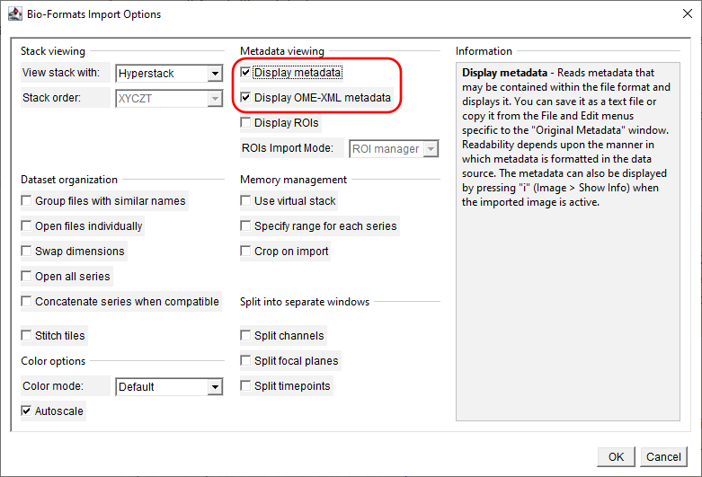

<!-- TOC ignore:true -->
# How to open Zeiss files with ImageJ2/Fiji

By Ivan Calandra

<!-- TOC ignore:true -->
# Table of content

<!-- TOC -->

- [Introduction](#introduction)
- [Download and install Fiji](#download-and-install-fiji)
- [Read files](#read-files)
    - [Import CZI files](#import-czi-files)
    - [Open SEM TIFF files](#open-sem-tiff-files)

<!-- /TOC -->

# Introduction

This document explains the main steps to open CZI and TIFF files from Zeiss microscopes with Fiji/ImageJ and access their metadata. 

ImageJ ([ImageJ2](https://imagej.net/software/imagej2/) for the most recent version) is an open-source software for scientific imaging. It is a very powertool to process scientific images, like microscope images.  
Fiji, which means ["Fiji Is Just ImageJ"](https://github.com/fiji/fiji), is ["an image processing package—a “batteries-included” distribution of ImageJ2, bundling a lot of plugins which facilitate scientific image analysis"](https://imagej.net/software/fiji/). One such plugin is [Bio-Formats](https://imagej.net/formats/bio-formats). 

[CZI](https://www.zeiss.com/microscopy/en/products/software/zeiss-zen/czi-image-file-format.html) is an open format, part of the [Bio-Formats](https://bio-formats.readthedocs.io/en/stable/formats/zeiss-czi.html) used for all Zeiss microscopes. It includes all the acquisition metadata. The [plugin Bio-Formats](https://imagej.net/formats/bio-formats) is necessary to open the CZI files (see section [Import CZI files](#import-czi-files)).  
Zeiss scanning electron microscopes (SEM) save images in TIFF format (in addition to CZI). The plugin [IMBalENce](https://imagej.net/plugins/imbalence) is necessary to read the metadata from these TIFF files (see section [Open SEM TIFF files](#open-sem-tiff-files)).  

The steps presented below are to be be run with ImageJ2/Fiji, including the plugins Bio-Formats & IMBalENce.

As a side note, Zeiss' CZI and TIFF files can also be processed with [Python](https://pypi.org/project/pylibCZIrw/), but this is outside of the scope of this document. 

# Download and install Fiji
Download and install ImageJ2/Fiji from the [official website](https://imagej.net/downloads) and follow the installation instructions there.  
There is actually no installation required. Unzip the downloaded file and move the extracted folder (`ImageJ` or `Fiji.app`) to a location where you have read and write access, for example in `C:\Users\[your name]\`.  

If you installed Fiji, you do not need to install the plugin Bio-Formats. If you installed ImageJ2, follow the instructions [here](https://bio-formats.readthedocs.io/en/stable/users/imagej/installing.html) to install the plugin Bio-Formats.  
Follow the instructions [here](https://imagej.net/plugins/imbalence#installation) to install the plugin IMBalENce.

To open and run ImageJ2/Fiji, simply open the file `ImageJ*.exe` (Windows).

# Read files
## Import CZI files
In ImageJ2/Fiji, go to `Plugins` > `Bio-Formats` > `Bio-Formats Importer` and select the CZI file you want to open.  

A new window opens with import options. In what concerns metadata, there are two complementary options: `Display metadata` will open all metadata from the file in a new window as a table, while `Display OME-XML metadata` will display only the standardized OME metadata as XML.  
If you choose the former, the most important information has the keys `Information` and `Scaling` (quite at the end of the list).

>

>     
>    <i>Bio-Format import options.</i>
>

When opening files like this, **the image will be scaled automatically**, that is, the pixel size (and therefore the image size in µm) will be extracted from the metadata. A scale bar can easily be added with `Analyze` > `Tools` > `Scale Bar...`.

## Open SEM TIFF files
In ImageJ2/Fiji, open the TIFF image for which you want to access the metadata.  
Then, go to `EM tool` > `SEM Zeiss metadata Scale`. A new window with the metadata opens.

When using the function `SEM Zeiss metadata Scale`, **the image will be scaled automatically**, that is, the pixel size (and therefore the image size in µm) will be extracted from the metadata. A scale bar can easily be added with `Analyze` > `Tools` > `Scale Bar...`.