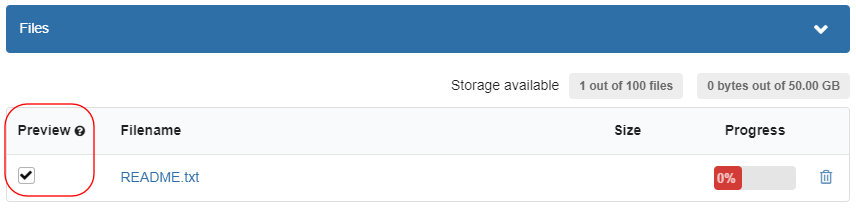
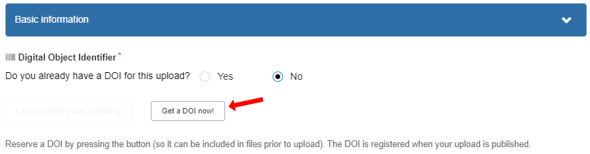
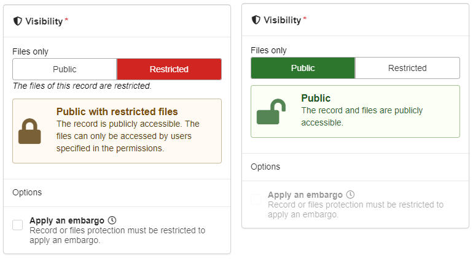
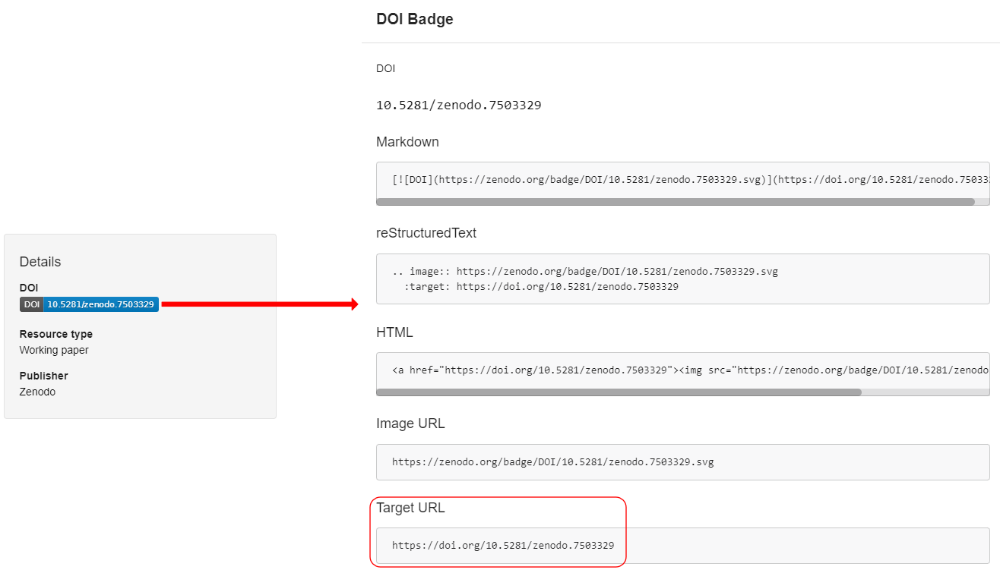
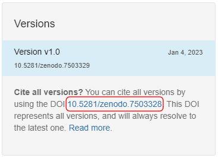
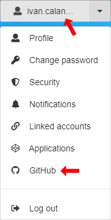
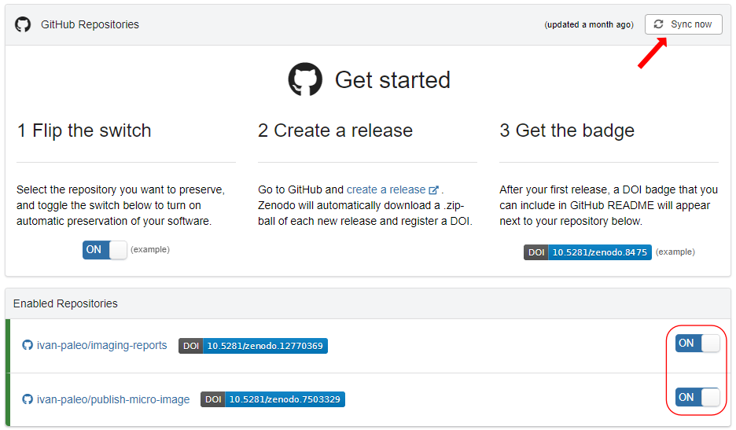

<!-- TOC ignore:true -->
# How to share data on Zenodo

By Ivan Calandra

<!-- TOC ignore:true -->
# Table of content

<!-- TOC -->

- [Introduction](#introduction)
- [Register at Zenodo](#register-at-zenodo)
- [Create a new record](#create-a-new-record)
    - [Community](#community)
    - [Files](#files)
    - [DOI](#doi)
    - [Other metadata](#other-metadata)
    - [Visibility](#visibility)
    - [Publish](#publish)
    - [Share](#share)
- [Edit an existing record](#edit-an-existing-record)
    - [Edit metadata](#edit-metadata)
    - [Edit data](#edit-data)
- [Share your GitHub repositories](#share-your-github-repositories)

<!-- /TOC -->

# Introduction

This template explain the main steps to upload files to [Zenodo](https://zenodo.org/). The [help pages on the Zenodo website](https://help.zenodo.org/) explain most of it probably better, but I have found that what colleagues usually lack are clear step-by-step instructions.  
The first time using Zenodo can feel complicated, especially because it is often done as a last step before submitting a manuscript.  
Therefore, I hope these instructions will help make it easier to every user.

While most steps are very general, some points are specific to LEIZA's IMPALA and/or TraCEr lab. Adapt as necessary!

Also note that I present only Zenodo. Not because it is the only alternative or because it is better, but simply because this is the tool I have been using for some years now. I like it, it does what I need and I find it quite simple.  
But you might want to have a look at some alternatives, e.g. [OSF](https://osf.io/),  [Figshare](https://figshare.com/) or [Dryad](https://datadryad.org/stash).

# Register at Zenodo
An account is necessary, so first [sign up](https://zenodo.org/signup/), or [sign in](https://zenodo.org/login/) if you already have an account.

# Create a new record
The [help page](https://help.zenodo.org/docs/deposit/create-new-upload/) details the steps nicely so I will not repeat them here, but I will focus here on some extra considerations.

In general, I recommend to create a new record when you are sure that you will not need to edit the files anymore (see section [Publish](#publish)) and shortly before you submit your manuscript.

## Community
Please select the [*TraCEr-IMPALA_Monrepos-LEIZA*](https://zenodo.org/communities/tracer-monrepos/) community, so that all records related to either TraCEr or IMPALA can be linked.

>

>     
>    <i>Zenodo community "TraCEr-IMPALA_Monrepos-LEIZA".</i>
>

## Files
It is not possible to upload folders, only files. So if the folder structure is important, ZIP the folders and upload them as if they were files. The drawback with this approach is that it will not be possible to download each file within the ZIP archive individually.

**You should always have a README to explain what the files are.** Make sure you tick the box *Preview* for the README file so that it will be the file displayed directly by default when someone opens the record.

>

>     
>    <i>Tick to preview the README file.</i>
>

## DOI
Zenodo can reserve a DOI: under *Basic information > Digital object identifier*, if you specify that you do not have a DOI already, you get the option to *Get a DOI now!* (see [here](https://help.zenodo.org/docs/deposit/describe-records/reserve-doi/) for details).  
When you do that, the DOI will be reserved, even before the record is [published](#publish). That means that **you can already use the DOI e.g. in your manuscript or in files in the record itself**.

>

>     
>    <i>Reserve a DOI.</i>
>

## Other metadata
1. Title: I recommend to use the title of the manuscript, appended with the type of data in the record, e.g. "Manuscript title [microscope data]".
2. Creators/Contributors: Add all authors, either as [*Creators*](https://help.zenodo.org/docs/deposit/describe-records/creators/) or [*Contributors*](https://help.zenodo.org/docs/deposit/describe-records/contributors/). Adding their ORCID iD will add the record to their ORCID profiles.
3. License: an open license is necessary, but there are many. My favorite is "Creative Commons Attribution Share Alike 4.0 International" ([CC BY-SA 4.0](https://creativecommons.org/licenses/by-sa/4.0/)) because it "forces" users of your data to share their data in open access as well. See [here](https://help.zenodo.org/docs/deposit/describe-records/licenses/) for details.
4. Related works: in case this record relates to other works, specify their identifiers here. Related works could be other records related to the same publication/project (e.g. different types of data), a published pre-print, a database (web interface)...

## Visibility
The visibility can be *Restricted* if you want to avoid people accessing your data before the manuscript is published. In that case, make sure you get a link for the reviewers and editors (see section [share](#share)).

**Latest when the manuscript is published, make sure that the visibility is set to *Public*.**

>

>     
>    <i>Choose whether access to the record should be public or restricted.</i>
>

## Publish
Before publishing, you can *Preview* the record to check that everything is fine.  
It is also possible to *Save draft*, especially in case you want to [reserve the DOI](#doi) but do not want to publish yet.

Before you click on *Publish*, it is important to understand that **the data (files) cannot be changed once the record is published**, whether public or restricted, because a DOI links to specific data (see [here](https://help.zenodo.org/docs/deposit/about-records/#life-cycle)). Different data --> different DOI. So be sure that you have the proper files uploaded before publishing.  
For the same reason, **a published record cannot be deleted** (but see [here](https://help.zenodo.org/docs/deposit/manage-records/#delete) for exceptions).  

If you do need to change the files, refer to the section [Edit data](#edit-data).

## Share
If the record is public, do not share it with its URL (https://zenodo.org/records/...) but rather with its DOI (https://doi.org/10.5281/zenodo...). To get the DOI, the easiest is to click on the DOI badge (in the *Details* section in the column on the right side) and copy/paste the *Target URL*.

>

>     
>    <i>Get the DOI of a record.</i>
>

**As long as the record is restricted, share it with a link. This is the link that must be forwarded to the reviewers/editors.** You can also share with users, for example your colleagues, but this is not a viable option for reviewers obviously. Follow the instructions [here](https://help.zenodo.org/docs/share/link-sharing/).  

# Edit an existing record
Editing a record is always necessary, especially during the publication process (new data/information during the revision stage, DOI of the publication, changing visibility, embargo, etc.).  

## Edit metadata
The metadata can be changed *ad libitum*. See [here](https://help.zenodo.org/docs/deposit/manage-records/#edit) for instructions.
  
All fields can be edited as necessary, but I would like to highlight some specific cases that are often forgotten, yet are important for making the record "findable" (according to the FAIR principles):  
1. Change the visibility to Public, latest once the associated manuscript is published (see section [Visibility](#visibility)).  
2. Add the publication's DOI as a related work (see section [Other metadata](#other-metadata)).  
3. Add the publication's details (journal's title, volume, page numbers; book title; etc.) under *Publishing information*.

## Edit data
It can happen, for example during the revision stage, that you need to change the data (files) that you have uploaded. It can be because you rerun the analysis (and got different results) or because you analyzed differently.

As explained before (see section [Publish](#publish)), it is not possible to change the files of an existing record. If you need to change the files, you need a new record with a new DOI. Fortunately, rather than a completely new and independent record, it is possible to **create a new version of the record**. In that case, all versions are linked to each other and changing only one a few files out of many is easy and fast.  

The procedure is explained [here](https://help.zenodo.org/docs/deposit/manage-versions/).

Each version has its own DOI. But there is also an "all-version" DOI, as explained [here](https://support.zenodo.org/help/en-gb/1-upload-deposit/97-what-is-doi-versioning). This all-version DOI can be very useful if you want to be sure that users will always be directed to the latest version. But for example in publications, **it is often important to cite a specific version**, for example in publications because this specific version has been used as a basis for the publication, not any of the earlier versions nor any of the possible later versions.

>

>     
>    <i>All-version DOI.</i>
>

# Share your GitHub repositories
GitHub is a useful platform for hosting and versioning of code, e.g. R or Python analysis. However, **GitHub is not meant for long-term archiving, unlike Zenodo.** So both are complementary and should be used in combination.   
Zenodo offers a GitHub integration that make it very easy to automatically archive GitHub repositories on Zenodo.

Note that there are alternatives to GitHub, for example [GitLab](https://about.gitlab.com/) or [Codeberg](https://codeberg.org/) but they are not integrated to Zenodo like GitHub. So I will present here only the GitHub integration.

**The procedure is quite easy, but the order really matters.** It is explained [here](https://docs.github.com/en/repositories/archiving-a-github-repository/referencing-and-citing-content) but I find this quite vague, so I have made it clearer (hopefully) below.

1. Connect GitHub with Zenodo:  
First, from Zenodo, [connect your GitHub account with your Zenodo account](https://help.zenodo.org/docs/profile/linking-accounts/).

2. Make your GitHub repository public:  
On GitHub, if necessary, [change the visibility of the repository](https://docs.github.com/en/repositories/managing-your-repositorys-settings-and-features/managing-repository-settings/setting-repository-visibility#changing-a-repositorys-visibility) to public. If it is private, Zenodo cannot have access to it.

3. Activate archiving of the repository:  
On Zenodo, click the profile menu in the header and select *GitHub*. 

>

>     
>    <i>Menu "GitHub" on Zenodo.</i>
>

Click on *Sync now* in the upper right corner. Finally, flip the switch for the repository you want to automatically archive.

>

>     
>    <i>Sync GitHub repositories with Zenodo.</i>
>

4. Create a new release:  
On GitHub, [create a new release](https://docs.github.com/en/repositories/releasing-projects-on-github/managing-releases-in-a-repository#creating-a-release) of your repository.

5. Get a DOI automatically:  
On Zenodo, click again on *Sync now* in the GitHub menu (see #3 above). The new release for the repository should now have a DOI badge; just click on it to open the record (see section [Share](#share)). Note that it can take some time to create the record if the GitHub repository is large.

6. Edit the metadata:  
The metadata will be imported from GitHub, but some adjustments/additions might be needed (see section [Edit metadata](#edit-metadata)).